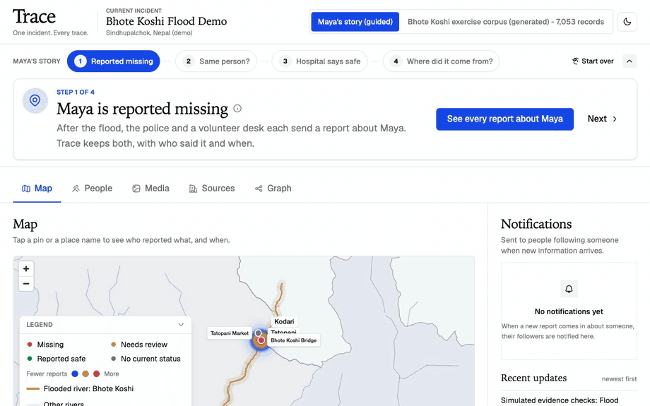
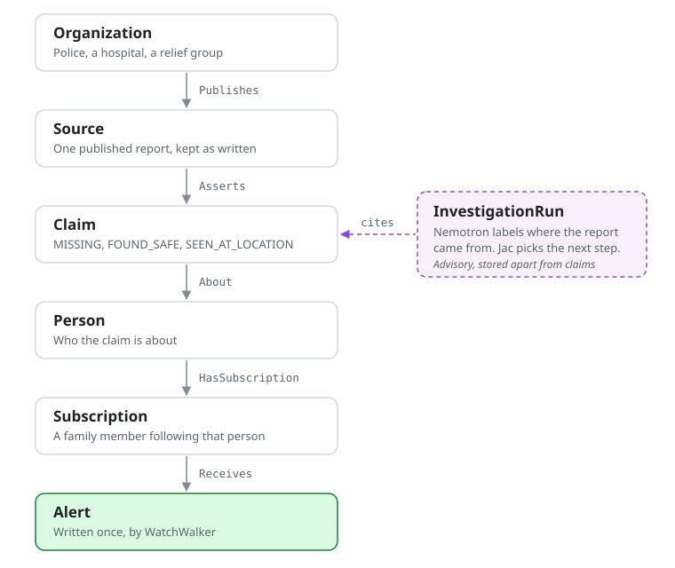
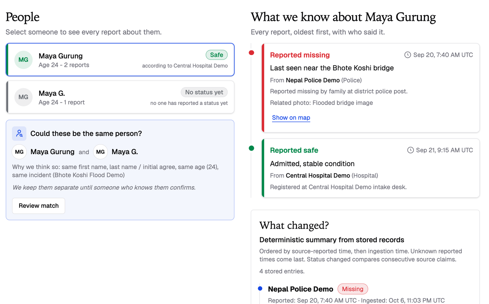
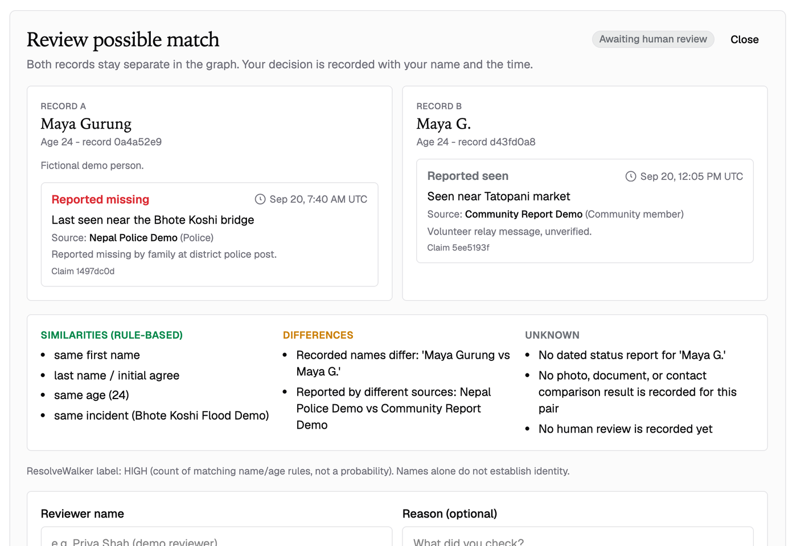
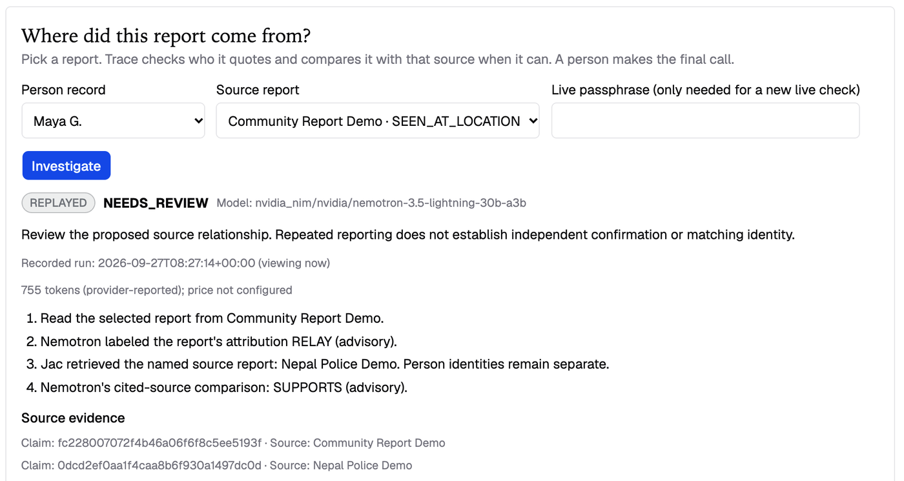
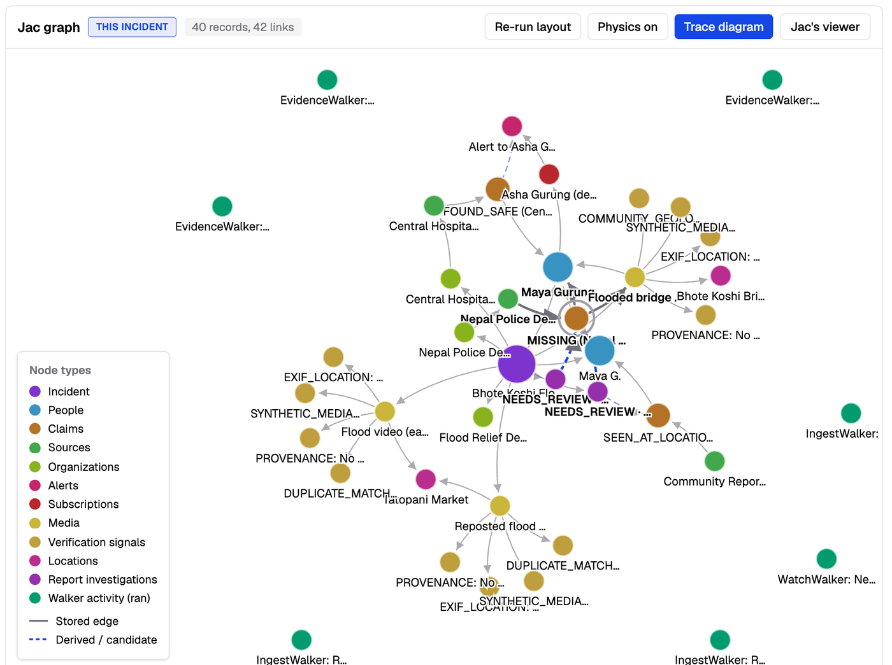
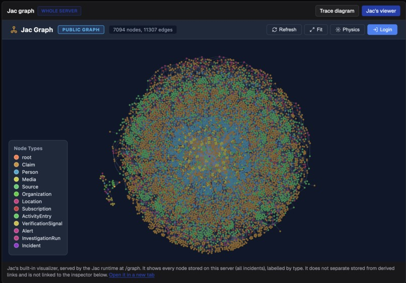
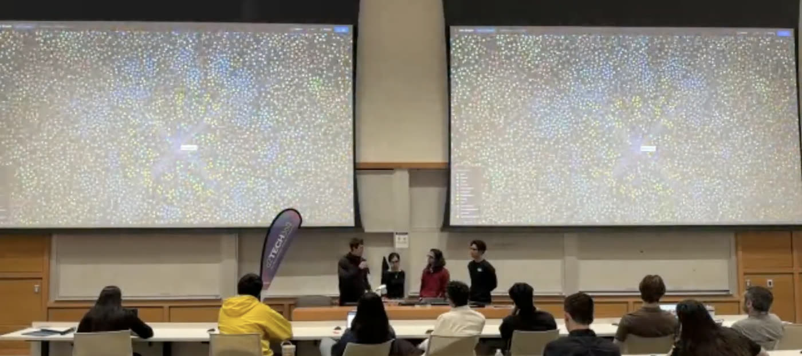

# Trace

**One incident. Every trace.**

🏆 **Winner — 1st Place, Agentic AI Track at JacHacks 2026**

Trace keeps a disaster as one persistent graph of sources, claims, people and alerts, so a
new report sits beside the old ones instead of overwriting them.

<p align="center">
  
</p>
<p align="center">
  <i>Maya's story, start to finish: reported missing, matched, reported safe, traced to its source.</i>
</p>

After a flood, the police say Maya is missing. A day later a hospital says she is
safe. Most tools would flip a status field and lose the first report. Trace keeps
both, alerts the family member who subscribed to her, and can tell you where each
report got its information.

It is one [Jac](https://docs.jaseci.org/) app with five tabs: Map, People, Media,
Sources and Graph. All people, organizations and reports are fictional.

## How it works

Every screen reads the same graph. A source publishes a claim about a person; a
walker follows the edges from that claim to the people subscribed to her and writes
an alert.

<p align="center">
  <picture>
    <source media="(prefers-color-scheme: dark)" srcset="docs/images/graph-shape-dark.svg">
    
  </picture>
</p>

### 1. Reports are kept, never replaced

The police `MISSING` report and the hospital `FOUND_SAFE` report both stay on Maya's
timeline, each with who said it and when. The status shown is a cited summary of
those reports.



### 2. A person decides whether two records are the same

"Maya Gurung" and "Maya G." might be one person. Trace lists the rule-based
similarities, the differences and what is unknown, then waits for a reviewer. Both
records stay separate either way.



### 3. The model labels, Jac decides

A volunteer post says "According to Nepal Police". NVIDIA Nemotron labels the
attribution (direct, relay or unclear). Jac then chooses the next step: stop,
retrieve the named source and compare, or hand it to a person. Labels come from the
model; every action, traversal, timestamp and number comes from Jac.



### 4. The graph is the app

The Graph tab draws the stored nodes and typed edges behind every other tab, with
live physics written in Jac and no graph library.



Switch to Jac's built-in viewer and the same tab shows every node on the server. With
the exercise corpus loaded that is 7,094 nodes and 11,307 edges.



## Run it

You need the **Jac 0.34.1 native binary**, the version this was tested with. Do not
substitute another CLI version or the `jaclang` PyPI package. See the
[official installation guide](https://docs.jaseci.org/quick-guide/install/).

```sh
jac --version
jac install
jac start --dev main.jac
```

Open the URL printed by the server and follow the story bar at the top: four steps,
each with a button that runs the real action. Run only one server against this
checkout's `.jac/data/` graph store. The core story needs no model credentials.

<details>
<summary>Live model checks (optional)</summary>

| Setting | Value |
| --- | --- |
| Model | `nvidia_nim/nvidia/nemotron-3.5-lightning-30b-a3b` (NVIDIA hosted API) |
| Client | Jac `by llm()` (byLLM) over litellm 1.102.1, typed enum outputs |
| Call settings | temperature 0, 96 output tokens, no retries, reasoning off, 45 s limit |
| Prompt version | `report-lineage-v4` |
| Calls per check | at most 2 (attribution, then one source comparison for a relay) |

| Environment variable | Purpose |
| --- | --- |
| `NVIDIA_NIM_API_KEY` | NVIDIA API key, server-side only. |
| `TRACE_LIVE_PASSPHRASE` | Required for live checks (typed into the People panel) and, when set, for publishing, PFIF import and media changes. Unset means live checks are off and nothing is locked. |
| `TRACE_MODEL_REQUEST_CAP` | Optional lifetime request cap for the server's ledger (default 200, 1-1000). |
| `LITELLM_LOCAL_MODEL_COST_MAP=True` | Stops litellm downloading its price list at startup. |

Every request is written to `.trace-local/model-usage.json` before it is sent and is
never refunded; Reset does not touch it. Details, statuses and the evaluated cases are
in [docs/INVESTIGATION.md](docs/INVESTIGATION.md).

</details>

## What is real and what is not

Publishing, alerts, identity review, the timeline, SHA-256 copy matching of uploaded
images and the graph all run on stored data. The seeded media checks (EXIF, C2PA,
synthetic-media) are simulated and labeled as such in the UI. The two source checks
shown on first load are real recorded Nemotron runs, labeled REPLAYED. There is no
authentication, continuous monitoring or external alert delivery.

The full list is in [docs/LIMITS.md](docs/LIMITS.md).

## Tests

```sh
jac test tests features/people/test_identity_review.jac features/graph/test_graph.jac features/media/test_media.jac features/media/test_media_integration.jac
jac build --check_only
jac build --client web
```

The investigation suite uses a mock model and a temporary ledger; it makes no network
or paid model calls.

## More documentation

| Page | What it covers |
| --- | --- |
| [docs/DEMO.md](docs/DEMO.md) | The guided story step by step, the write lock, and what happens when live checks are unavailable |
| [docs/LIMITS.md](docs/LIMITS.md) | Current behavior and limits of every tab |
| [docs/MAP.md](docs/MAP.md) | Map data sources, pin rules and the browser checks |
| [docs/INVESTIGATION.md](docs/INVESTIGATION.md) | The Nemotron source check: setup, request cap, ledger, statuses and tests |
| [docs/PUBLISHING.md](docs/PUBLISHING.md) | Report validation, provenance, alerts and reset |
| [docs/TEAM.md](docs/TEAM.md) | Ownership, tab interfaces and integration checks |
| [AGENTS.md](AGENTS.md) | Engineering and evidence rules |

## Code map

| Path | Responsibility |
| --- | --- |
| `main.jac` | Endpoint registration, CSS entry, and route |
| `components/TraceDashboard*`, `components/shared/` | Shared shell and presentation |
| `features/<tab>/` | Tab UI, feature services, and focused tests |
| `graph/nodes.jac`, `graph/edges.jac`, `graph/activity.jac` | Persistent schema and activity helpers |
| `walkers/` | Ingestion, identity proposals/reviews, seeded and upload evidence, watching |
| `services/trace.jac`, `services/geo.jac` | Shared snapshot/actions and boundary data |
| `services/investigation.jac`, `integrations/nemotron.jac` | Report checks and the model boundary (typed labels, passphrase, ledger) |
| `demo/seed.jac`, `demo/reset.jac`, `tests/` | Executable fixtures, isolated reset, and tests |
| `styles/trace-tokens.css` | Trace theme tokens; imports generated `global.css` |

`.jac/` and `dist/` are generated/ignored. `.jac/data/` holds local graph data;
`.trace-local/` holds the persistent model request ledger. Neither is source code or a
cleanup target. `geometry.topo.json` is required map data.

[Dataset rules](docs/plans/test-data/TEST_DATA_RULES.md) and their linked schemas
describe a future corpus, not current fixtures or APIs.

## Team

Built in one night at JacHacks 2026 by four undergraduates learning Jac as they went.

| Person | Owned |
| --- | --- |
| Anshu Pathak | Sources and Map tabs, ingestion, shared integration |
| Miguel Orti Vila | Graph tab and the graph schema |
| Gabriel Salvatore | People tab and identity matching |
| Aidana Kuat Adilbekyzy | Media tab and evidence checks |


